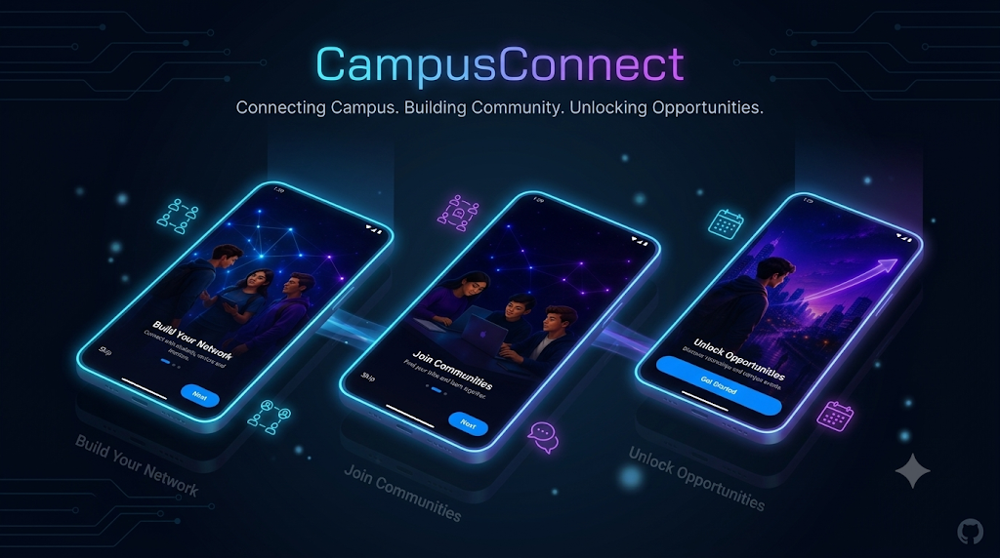
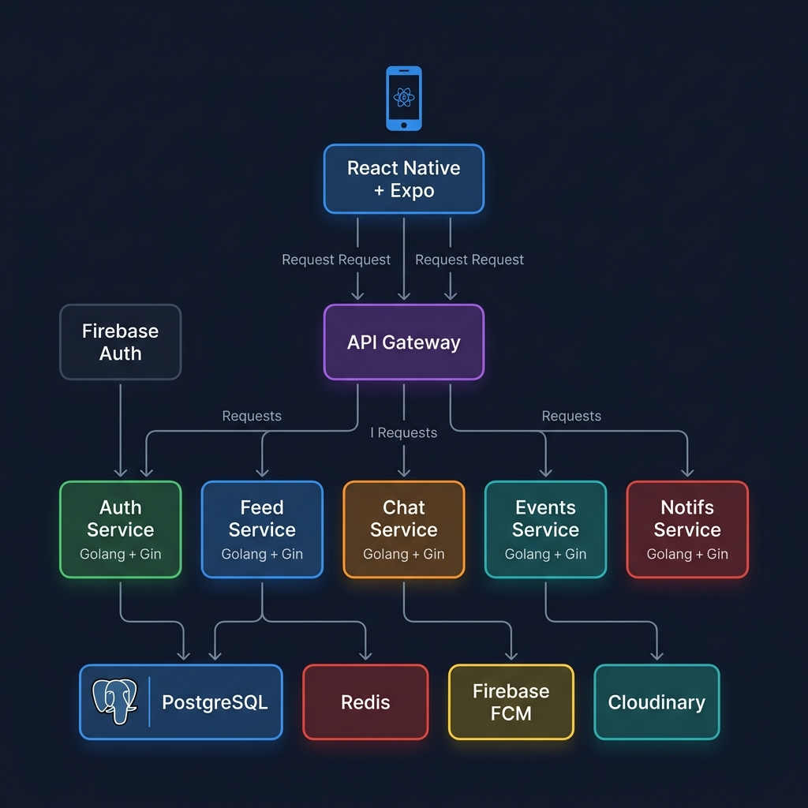
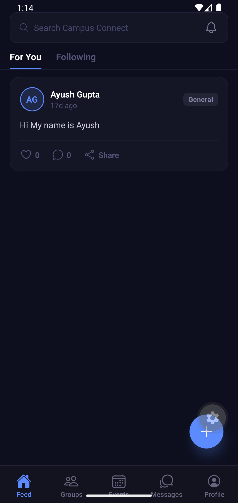
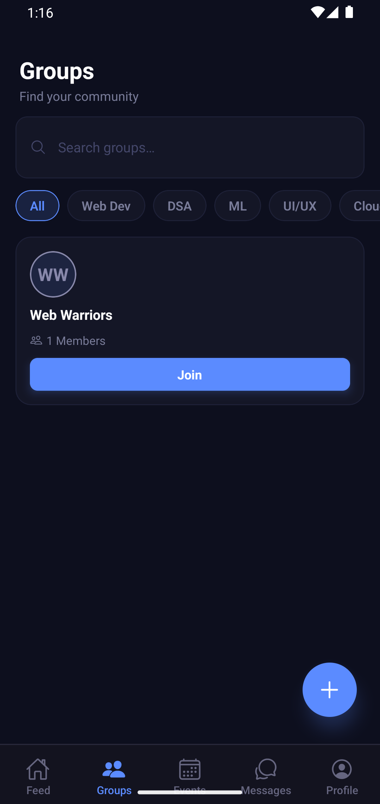
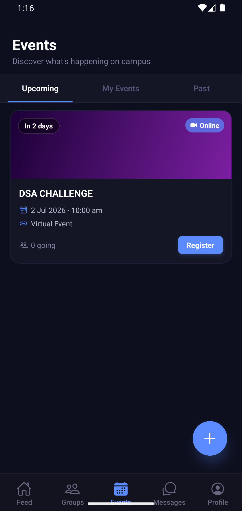
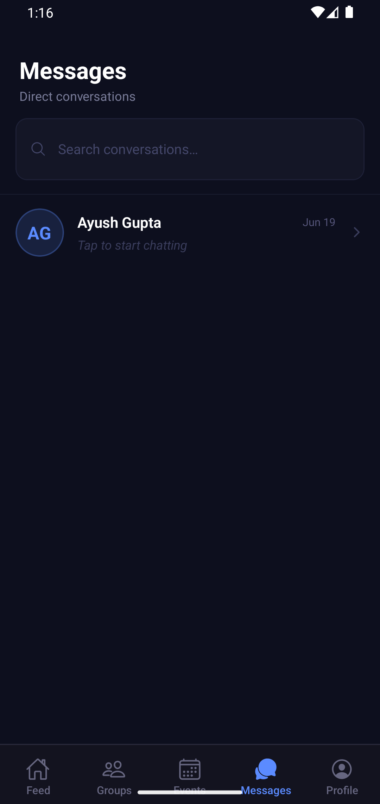
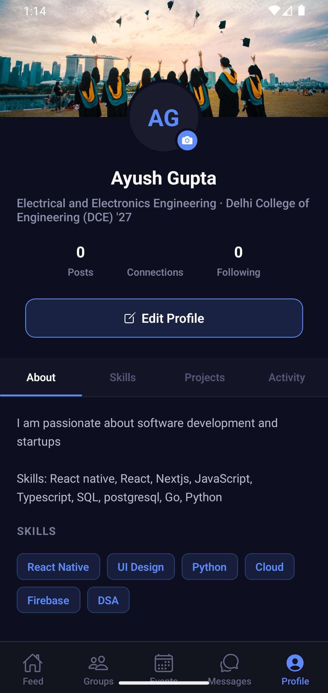
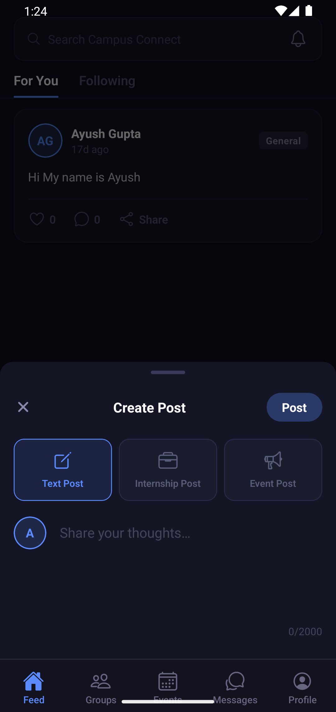

<div align="center">
  
  
  <h3>The all-in-one social platform built for college students.</h3>
  <p>Network. Study. Chat. Events. Referrals.</p>

  <p>
    <a href="https://github.com/ayushgupta-15/college-social-app/commits/main">
      
    </a>
    <a href="https://github.com/ayushgupta-15/college-social-app/stargazers">
      
    </a>
    <a href="https://github.com/ayushgupta-15/college-social-app/issues">
      
    </a>
  </p>

  > **Full-stack college social networking platform with React Native, Go, WebSockets, Firebase Auth, PostgreSQL, Redis, and real-time messaging.**
</div>

---

## 🎥 Demo

<div align="center">
  
  <p><i>Login • Feed • Create post • Join group • Register event • Chat • Profile</i></p>
</div>

---

## 🎯 Why CampusConnect?

Students use multiple disconnected platforms:
- **LinkedIn** for networking
- **Discord** for chats
- **WhatsApp** for groups
- **Google Sheets** for referrals

**CampusConnect** unifies them into one mobile-first platform built specifically for college communities.

---

## ✨ Features

- **Auth & Profiles**: Firebase Auth, JWT, rich student profiles (major, graduation year, skills).
- **Social Feed**: Real-time cursor-paginated feed with optimistic likes and threaded comments.
- **Study Groups**: Discover and join subject-specific study groups.
- **Campus Events**: Browse, register, and track campus events with capacity enforcement.
- **Direct Messaging**: Real-time WebSocket chat with delivery states.
- **Notifications**: Real-time FCM push notifications for social actions.

---

## 🏗️ System Architecture

<div align="center">
  
</div>

The platform is designed for scale and real-time responsiveness. Check out the [**Architecture Documentation**](docs/Architecture.md) for a deep dive into the system design.

---

## 📱 Mobile Experience

<div align="center">
  <table>
    <tr>
      <td align="center"><br><b>Feed</b></td>
      <td align="center"><br><b>Groups</b></td>
      <td align="center"><br><b>Events</b></td>
    </tr>
    <tr>
      <td align="center"><br><b>Messages</b></td>
      <td align="center"><br><b>Profile</b></td>
      <td align="center"><br><b>Create Post</b></td>
    </tr>
  </table>
</div>

---

## ⚙️ Backend Architecture

Our Go-based backend manages data across multiple scalable services. 

Read more in the [**Architecture Wiki**](docs/Architecture.md).

---

## 🗄️ Database Design

The relational nature of our social graph (Users, Posts, Likes, Follows, Groups) is modeled in PostgreSQL.

<div align="center">
  
</div>

For a full schema breakdown, see the [**Database Design Wiki**](docs/Database-Design.md).

---

## 📡 API Overview

A robust RESTful API paired with WebSockets. 

| Module        | Endpoints |
| ------------- | --------- |
| Auth          | 4         |
| Users         | 5         |
| Feed          | 7         |
| Groups        | 5         |
| Events        | 5         |
| Chat          | 3         |
| Notifications | 2         |

Explore the complete API specification in the [**API Reference Wiki**](docs/API-Reference.md).

---

## 🧩 Engineering Challenges

Building CampusConnect involved solving complex system design problems:
- **JWT authentication** bridging Firebase and backend sessions.
- **WebSocket scaling** for real-time messaging.
- **Cursor pagination** for a drift-free feed experience.
- **Transactional joins** across highly relational data.
- **Push notifications** integration via Firebase Cloud Messaging.
- **Cloudinary uploads** for high-performance media delivery.
- **Firebase integration** handling robust authentication lifecycle.
- **Redis session caching** for rapid access and reduced database load.

---

## 🛠 Tech Stack

**Mobile**


**Backend**


**Database & Cache**


**Infrastructure & Services**


---

## 📁 Folder Structure

```
college-social-app/
├── backend/                    # Go + Gin REST API & WebSockets
├── mobile/                     # React Native + Expo App
└── docs/                       # Project Documentation
```

---

## 🚀 Setup & Deployment

- **[Development Setup](docs/Development-Setup.md)**: Instructions for running the mobile app and backend locally.
- **[Deployment Guide](docs/Deployment-Guide.md)**: Details on deploying to Render and configuring production services.

---

## 🗺️ Roadmap

- [ ] AI Resume Review & Career Guidance
- [ ] Referral Marketplace between seniors and juniors
- [ ] Placement & Internship Tracker
- [ ] Global cross-entity search
- [ ] Media uploads for avatars, posts, and event banners

---

## 📄 License

MIT © 2026
