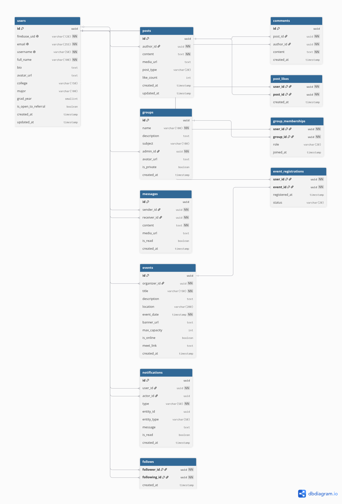

# Database Design

CampusConnect relies on a relational PostgreSQL database. We use 12 sequential migrations covering the full data model.

## Core Tables

| Table | Key Columns | Description |
|-------|-------------|-------------|
| `users` | `id`, `firebase_uid`, `email`, `full_name`, `bio`, `college`, `major`, `grad_year`, `avatar_url`, `fcm_token`, `is_open_to_referral` | User identity and profile details |
| `follows` | `follower_id`, `followee_id` | Social graph associations |
| `posts` | `id`, `author_id`, `content`, `post_type`, `media_url` | Feed items |
| `comments` | `id`, `post_id`, `author_id`, `content` | Threaded replies to posts |
| `post_likes` | `post_id`, `user_id` | Tracks likes for optimistic toggling |
| `groups` | `id`, `name`, `description`, `subject`, `admin_id`, `is_private` | Study groups |
| `group_memberships` | `group_id`, `user_id` | Many-to-many relationship for group members |
| `messages` | `id`, `sender_id`, `recipient_id`, `content`, `is_read` | Real-time chat history |
| `events` | `id`, `title`, `organizer_id`, `event_date`, `location`, `max_capacity`, `is_online` | Campus events |
| `event_registrations` | `event_id`, `user_id` | Tracks event attendees |
| `notifications` | `id`, `user_id`, `actor_id`, `type`, `entity_id`, `is_read` | In-app alerts |

The schema enforces data integrity through foreign keys, uniqueness constraints, and transactional limits (e.g. event capacity).
